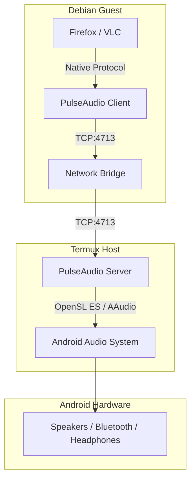

# Audio Architecture
**Project:** Systemless Host Termux-SU

## 1. Flow Diagram

---

## 2. Configuration Details

### 2.1 Host Side (Termux)
- **Startup Command:** `pulseaudio --start --load="module-native-protocol-tcp auth-ip-acl=127.0.0.0/8" --exit-idle-time=-1`
- **Modules Loaded:**
    - `module-sles-sink`: Connects to Android OpenSL ES.
    - `module-native-protocol-tcp`: Enables TCP listener on port 4713.

### 2.2 Guest Side (Debian)
- **Client Config:** `/etc/pulse/client.conf`
    - `default-server = tcp:127.0.0.1:4713`
    - `autospawn = no`
- **Latency Control:** Buffering is handled by the host server; guest apps see a standard PulseAudio device.

---

## 3. Known Issues & Optimizations

- **Bluetooth Audio:** Latency may be higher than built-in speakers due to the double-hop (Guest → Host → Android → BT).
- **Microphone:** Currently configured to use `module-sles-source` if available on the host.
- **Volume Control:** Preferred method is using the host's volume keys or the `xfce4-pulseaudio-plugin` which correctly bridges to the host server.

---
**Status:** Audio System Audit Complete. Moving to Phase 6 (Firefox).
