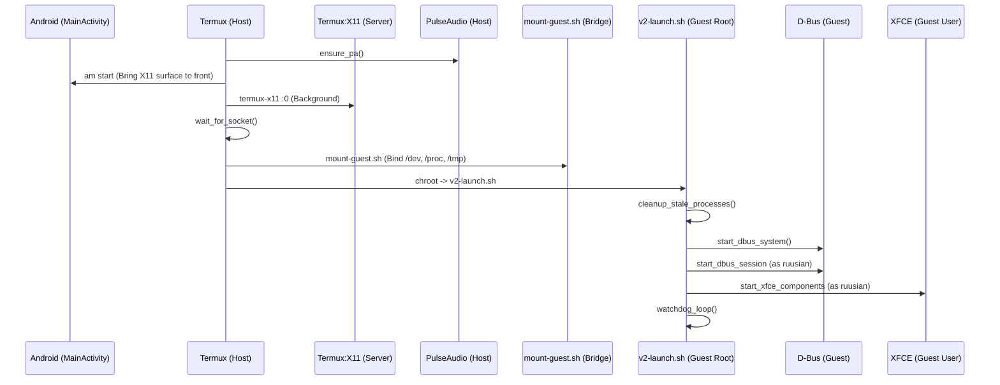

# GUI Startup Pipeline Documentation
**Version:** 2.0 (V20 Core)

## 1. Sequence Diagram

---

## 2. Component Analysis

### 2.1 Host Side (start-gui.sh)
- **Stale Lock Mitigation:** `rm -f $TERMUX_TMP/.X0-lock` is performed before launch.
- **Activity Guard:** `am start` ensures the Android OS doesn't sleep the X11 surface.
- **Wait Logic:** Polling for `-S $TERMUX_TMP/.X11-unix/X0` is reliable but blocks for up to 20s.

### 2.2 Bridge Side (mount-guest.sh)
- **Critical Bind:** `/data/data/com.termux/files/usr/tmp/.X11-unix` -> `/tmp/.X11-unix`.
- **GPU Node Bind:** `/dev/dri` and `/dev/kgsl-3d0` are bound for acceleration.
- **Permission Fix:** `chmod 1777 /tmp` inside chroot is essential for D-Bus.

### 2.3 Guest Side (v2-launch.sh)
- **Identity:** Runs as `root` to manage system bus and `runuser` to drop privileges.
- **Watchdog:** Monitored processes: `xfwm4`, `xfce4-panel`, `xfdesktop`, `xfsettingsd`.
- **Theme Injection:** `sh /home/ruusian/.apply-theme.sh` ensures visual consistency.

---

## 3. Vulnerability Assessment

### 3.1 Race Conditions
- **PulseAudio Startup:** If `pulseaudio --start` takes more than 2 seconds, XFCE components may fail to find the sink on initial launch.
- **X11 Socket Availability:** There is a gap between the socket appearing and the server being ready to accept clients.

### 3.2 Stale States
- **Watchdog Desync:** If the host `termux-x11` is killed and restarted, the guest components (launched by a previous watchdog) still have an environment variable `DISPLAY=:0` pointing to a dead socket descriptor. They must be re-launched.
- **D-Bus Orphans:** `dbus-daemon` orphans are not always killed by the `cleanup_old_processes` loop.

---

## 4. Optimization Plan

1. **Harden Cleanup:** Add `dbus-daemon` and `at-spi-bus-launcher` to the `killa` loop in `v2-launch.sh`.
2. **Watchdog X11 Check:** Add a `kill -0 $X11_PID` check inside the guest watchdog to detect host-side server death.
3. **Lazy Mount:** `mount-guest.sh` should be idempotent and "quiet" by default.

---
**Status:** Startup Pipeline Audit Complete. Moving to Phase 4 (Hardware Acceleration).
